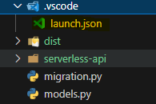
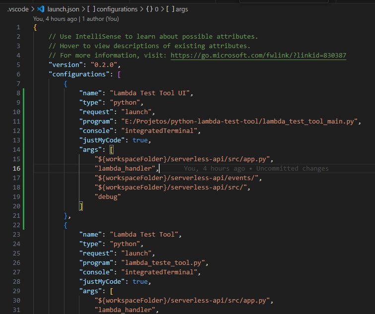
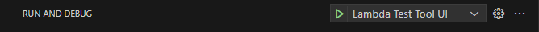
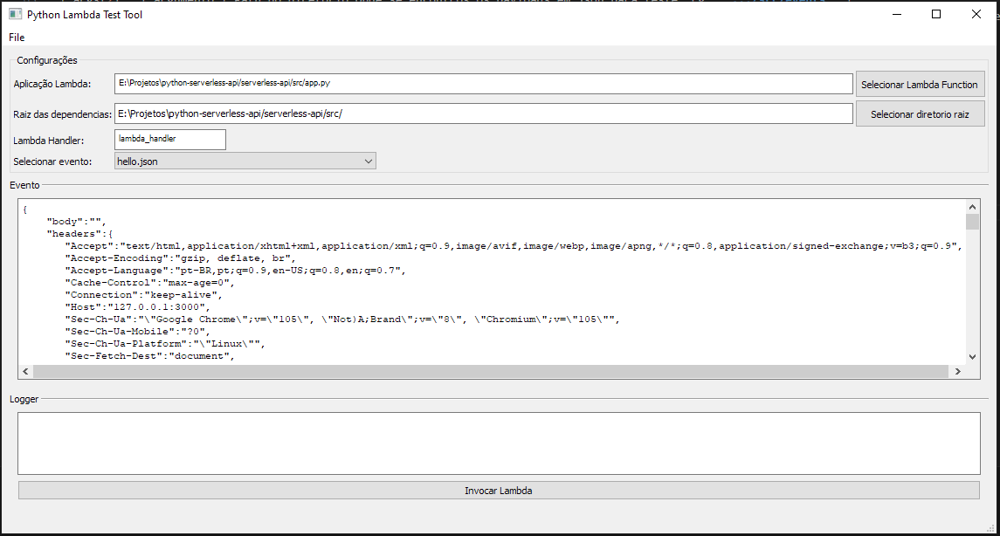
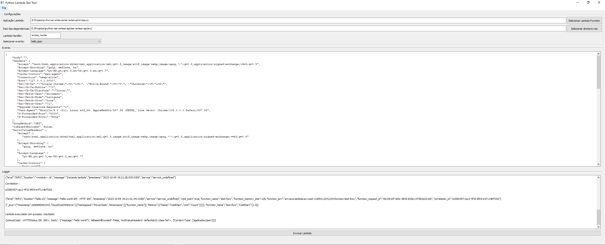

# Python Lambda Test Tool

Aplicação para facilitar os testes e debugging de aplicações AWS Lambda em Python.

## Table of Contents
- [Python Lambda Test Tool](#python-lambda-test-tool)
  - [Table of Contents](#table-of-contents)
  - [Features](#features)
  - [Instalação](#instalação)
  - [Uso](#uso)
## Features

- Menu File:
  - Abrir Json: Carrega o conteudo de um arquivo .json para ser utilizado como payload na invocação da lambda.
  - Salvar Json: Grava o conteudo da caixa de texto de eventos para um arquivo .json selecionado.
  - Selecionar diretorio de eventos: Seleciona um diretorio de onde serão carregados eventos no formato .json, todos os arquivos .json da localização serão selecionaveis no combobox de eventos. 
  O diretorio de eventos inicial é determinado pelo terceiro argumento do launch.json.
  - Instalar dependencias do projeto: Selecione um arquivo do tipo "requirements.txt" para instalar todas as dependencias listadas do seu projeto lambda.
- Botões:
  - Selecionar lambda function: Selecione um classe python que serve de entrypoint para sua lambda. Valor inicial definido pelo primeiro agumentos no launch.json.
  - Selecionar diretorio raiz: Selecione um diretorio raiz, para que a ferramente consiga encontrar dependencias locais. Valor inicial definido pelo quarto argumento no launch.json.
  - Invocar lambda: Invoca a aplicação lambda de acordo com as configurações definidas.
## Instalação

Clonar/Copiar a ferramenta de testes para um repositorio qualquer em sua maquina.

Instalar dependencias [requirements.txt](requirements.txt):

```bash
pip install -r requirements.txt
```

No VsCode, configurar ou adicionar no projeto lambda a ser testado o seguinte launch.json¹:



```json
{
    "version": "0.2.0",
    "configurations": [
        {
            "name": "Lambda Test Tool UI",
            "type": "python",
            "request": "launch",
            "program": "E:/Projetos/python-lambda-test-tool/lambda_test_tool_main.py",//Path da classe principal da ferramenta de testes 
            "console": "integratedTerminal",
            "justMyCode": true,
            "args": [
                "${workspaceFolder}/serverless-api/src/app.py",//Path da classe entrypoint da aplicação lambda
                "lambda_handler",//Nome do metódo handler da lambda
                "E:/Projetos/python-serverless-api/serverless-api/events",//Path do diretorio onde se encontros os payloads json para teste
                "${workspaceFolder}/serverless-api/src/",//Path do diretorio onde se encontra a raiz do projeto
                "debug"//Argumento opcional para "pular" a tela
            ]
        }
    ]
}
```

Significado dos parametros:

| Parametro | Tipo | Descrição |
|-----------------|-----------------|-----------------|
| program   | program  | Caminho da classe principal da ferramenta de testes: **lambda_test_tool_main.py**  |
| args[0]   | argumento  | Path da classe entrypoint da aplicação lambda Eg: **hanlder.py**  |
| args[1]   | argumento  | Nome do metódo handler na classe de entrypoint da aplicação lambda. Eg: **lambda_handler**  |
| args[2]   | argumento | Path do diretorio onde se encontros os payloads em json para teste. Eg: **.../src/events** |
| args[3]   | argumento  | Path do diretorio onde se encontra a raiz do projeto, necessario para que a ferramenta consiga acessar as dependencias locais do projeto, normalmente é o propio diretorio da classe de entrypoint da aplicação lambda. Eg: **.../src/**|
| args[4]   | argumento  | Argumento opcional para debuggar a aplicação lambda sem a UI  |

## Uso
Após ajustar o launch.json do projeto que voce quer testar, basta executar pelo menu de debug o perfil que voce configurou no lauch.json(F5 no vscode).
- Exemplo de launch.json:
 

- Menu Debug:



- A tela então aparecera, basta preencher os campos de acordo com as seções anteriores e invocar sua lambda atraves do botão:



- Por fim, o resultado da execução, juntamente com os logs, serão apresentados na textbox Logger:
  
